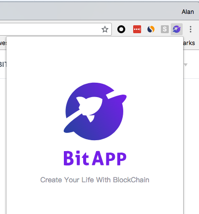

# Guidance

## Install

### Chrome extension

BitApp Chrome extension is now online，If your web page needs to use the API provided by BitApp, you need to install [Chrome extension](http://developer.bitapp.net) first.
After successful installation, a small icon will appear in the upper right corner of the Chrome browser.



If you encounter any problems during the installation, you can go directly to [github](https://github.com/bitapp) to issue problem or contact us. [support@bitapp.pro](mailto:support@bitapp.pro)

When the installation is finished, open the web page you developed in the new tab. The bitapp object will be automatically mounted under the window object.

```js

var bitapp = window.bitapp;

if (bitapp) {
  bitapp.preference.getDefaultAddress().then(addresses => {
    if(addresses.eth && addresses.bch) {
      //Query the user's default ETH account balance
      bitapp.eth.getBalance(addresses.eth).then(balance=>{
        console.log('My BitApp wallet eth address: ' + addresses.eth)
        console.log('balance: ' + balance)
      }).catch(e=>{
        console.error(e)
      })

      //Query the user's default BCH account balance
      bitapp.bch.getBalance(addresses.bch).then(balance=>{
        console.log('My BitApp wallet bch address: ' + addresses.bch)
        console.log('balance: ' + balance)
      }).catch(e=>{
        console.error(e)
      })
    } else {
      console.error('BitApp account not created')
    }
  })
}

```

### FireFox extension

BitApp FireFox is under development, please stay tuned。

### More platform versions

BitApp We plan to release more versions. In the future, we will launch independent versions of android and ios and provide unified API call experience. Please look forward to it.

## Introduction

BitApp aims to provide developers with blockchain infrastructure services and lower the threshold for developers to develop blockchain applications. We will be rolling out products and SDK that cover web, mobile and support multiple public chains. Helping developers build successful blockchain products is our first priority.

## Features

- **Multiple development language**

  We support JavaScript, nodeJS, Python and other development languages, and provide Android, iOS native SDK.

- **Multi-public chains unified API interface**

  We provides unified API call interface for multiple public chains, supports ETH, BCH and EOS, and aims to help developers support multiple public chains quickly and efficiently.

- **Integrated query API**

  It integrates common information query interfaces such as balances, transactions, and blocks. Developers will no longer need to obtain information from third-party services. The query interface is permanently free.
