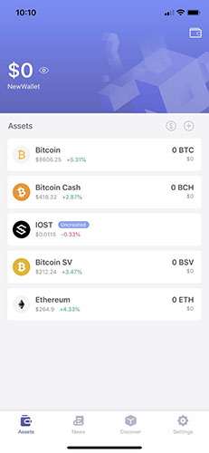
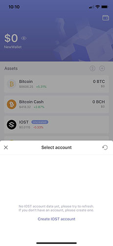
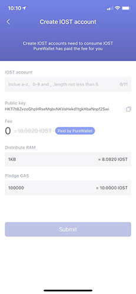

# IOST Free Account Creation

### 1. First you need to create or import a multi-currency or IOST only wallet

#### Wallet Create or Import Guide [Video Tutorial](https://youtu.be/kC1e86bQA_o)

#### Below is a new multi-currency wallet that has already been created

#### 2. Click the IOST icon

#### 3. Choose to create a new account or manage an existing IOST account

#### 4. After successful creation, you will have an IOST account after waiting for the confirmation of IOST network
