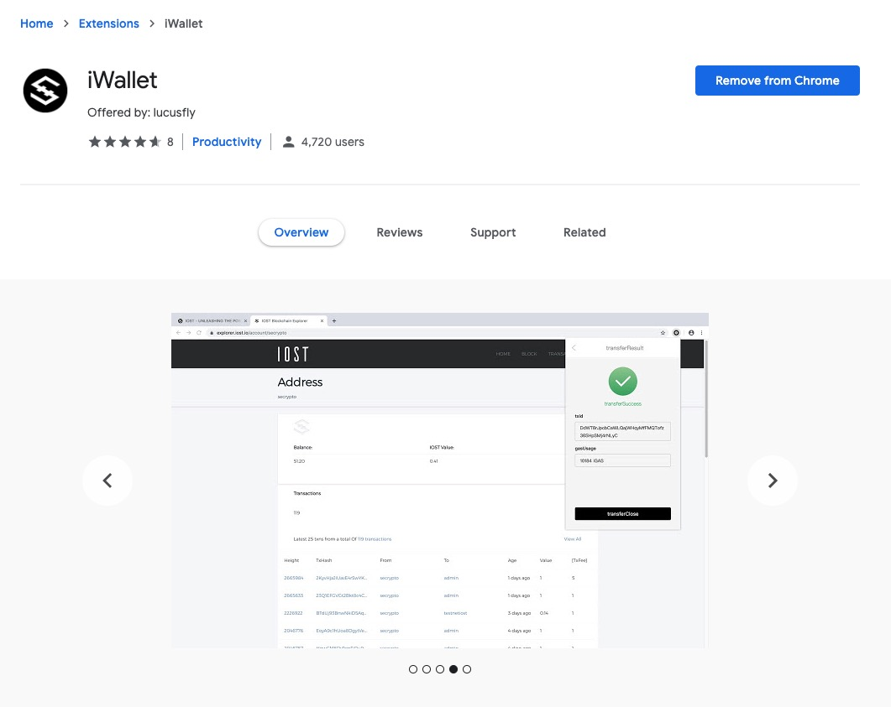
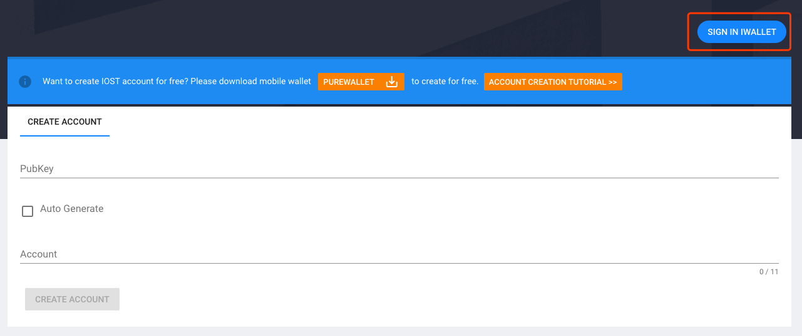
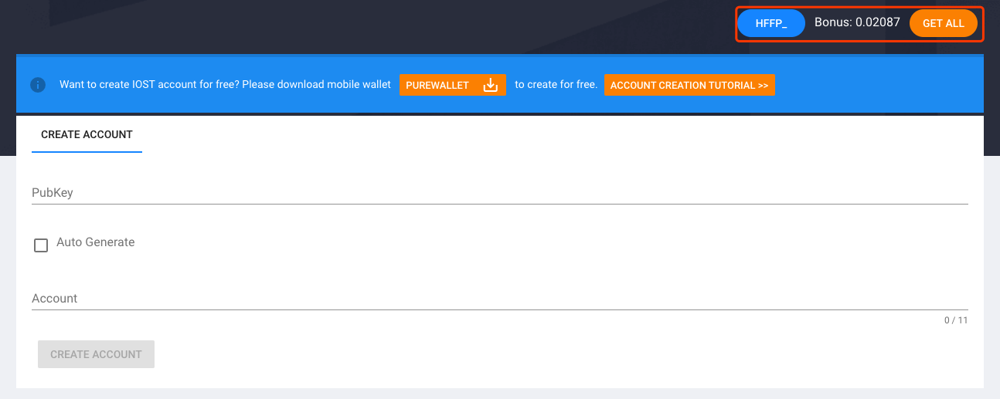
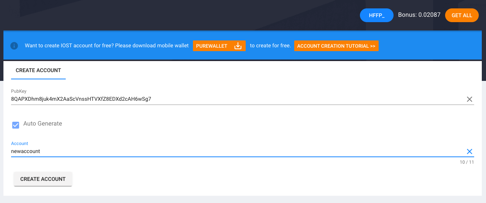

# IOST Pledge For New Account

## on Web

### 1. Download and install [iWallet](https://chrome.google.com/webstore/detail/iwallet/kncchdigobghenbbaddojjnnaogfppfj)

### 2. open iostabc.com

[https://www.iostabc.com/wallet/createaccount](https://www.iostabc.com/wallet/createaccount)

### 3. This will prompt you to log in to iWallet when you have not yet imported your IOST account to your iWallet or when your account is locked

### 4. You need to import an iWallet account with at least 10 IOST accounts and make sure the iWallet is unlocked. When you refresh the page, the following screen will appear

### 5. Now you can create a new account

## Create for free on Mobile

Download [PureWallet](https://www.purewallet.org/)，and go to [https://help.purewallet.org/zh/iostaccount/](https://help.purewallet.org/zh/iostaccount/)