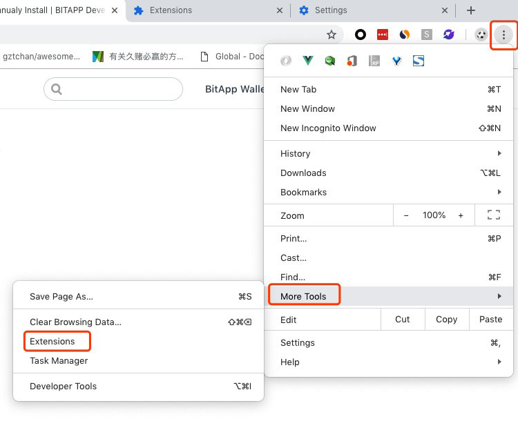
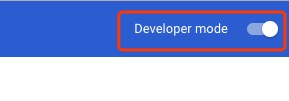
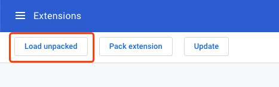
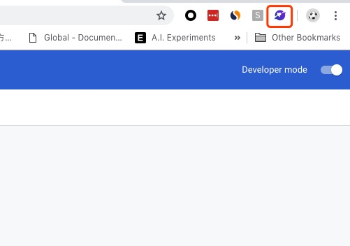

## Package Installation

### Steps

1.first make sure you are using **Chrome**;

2.[download BitApp](http://files.bitapp.net.cn/chrome-bitapp.zip);

3.unzip it to somewhere you can find;

4.in Chrome，find **Settings-->More Tools-->Extension**;

5.Toggle **Developer mode** on;

6.click **Load unpacked**，find that folder in step 3, then click OK;

7.Install Successfully.

