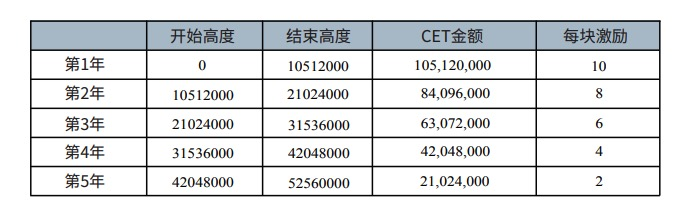

# CoinEx Chain 超级节点

## 关于CoinEx Chain超级节点

CoinEx Chain的验证节点初始数量为42个，未达到验证节点数量上限时，任何人都可以通过发出CreateValidator交易来创建验证者。网络验证节点达到上限后，验证节点按质押的CET数量进行排序，选取质押量最高的42个验证者。

## 超级节点奖励

CoinEx会信守不增发CET的承诺，因此不会采用通胀的方式铸造新币。然而区块激励对于提高社区参与度至关重要,因此在主网上线后，CoinEx基金会将分配3.15亿个CET，用户激励初期验证节点及staking参与者。预留CET激励发放的总体时长与出块间隔时间有关，激励计划按出块速度为3s进行估算，每个区块的具体奖励金额参见下面的表格：

## 超级节点奖扶持计划

CoinEx 宣布会扶持一部分对生态做出较大贡献的超级节点，基金会通过把自己的票投给响应的节点以达到扶持的目的，这部分的详细规划还没有出台，我们可以小小期待。

## 超级节点申请

CoinEx Chain 目前尚处在测试阶段，超级节点的申请目前尚未开启，可以随时保持关注。