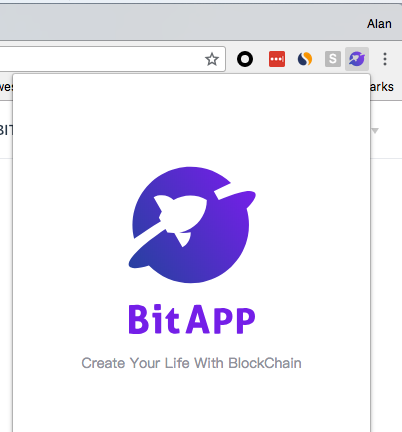

# 上手指南

## 安装

### Chrome 插件

bitapp 目前支持 Chrome 插件版本，如果你的web页面需要使用 bitapp 提供的API，可以安装[Chrome插件](http://www.bitapp.net/)。
安装成功之后，在chrome浏览器的右上角会出现小图标



如果在安装过程中遇到什么问题，可以直接到[github](https://github.com/bitapp)提issue给我们或者给 [support@bitapp.pro](mailto:support@bitapp.pro)

安装完成之后，在新tab中打开你所开发的网页，AppRoles对象会被自动挂载到window对象下

```js

var bitapp = window.bitapp;
bitapp.eth.accounts.getAccounts().then(accounts => { 
 // 用户账户
 console.log(accounts)
});

```

### FireFox 插件

bitapp FireFox 正在开发中，敬请期待。

### 更多平台版本

bitapp 计划推出更多的版本，未来会推出android，ios独立客户端版本并且提供统一的API调用体验，请广大开发者敬请期待。

## 介绍

bitapp 的宗旨

## 特性

- **多种开发语言**

  支持JavaScript, nodeJS, Python等多种开发语言, 提供Android, iOS原生SDK。

- **多公链统一API接口**

  为多条公链提供统一的API调用接口，支持ETH、BCH以及EOS，旨在帮助开发者快速高效的完成多条公链的支持。

- **集成查询API**

  集成常用的余额、交易以及区块等信息查询接口，开发者将无需再从第三方服务获取。查询接口永久免费。
