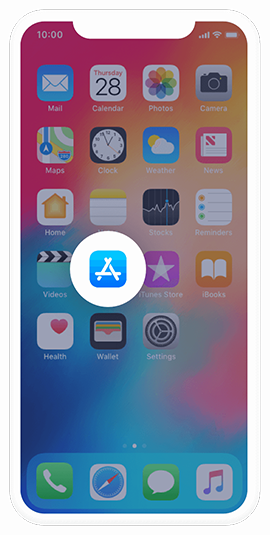
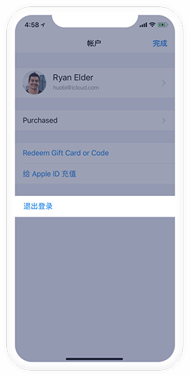
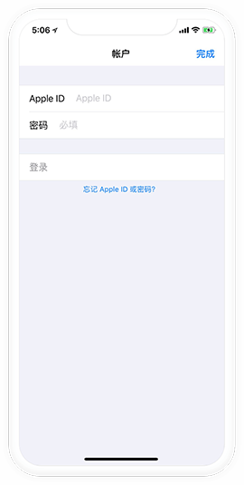

# 上手指南

## iOS PureWallet安装指引

由于中国区App Store政策限制，下载PureWallet需要使用海外账户登录海外App Store 下载

以下是免费的海外App Store账号供您使用

```
香港账户：iypwe5i4@icloud.com 密码：Aa112211
香港账户：tj31x0ew@icloud.com 密码：Aa112211
香港账户：k20ngj1p@icloud.com 密码：Aa112211
香港账户：ry883zqy@icloud.com 密码：Aa112211
香港账户：f08isz3s@icloud.com 密码：Aa112211
香港账户：d296r939@icloud.com 密码：Aa112211

```

### 1.点击蓝色App Store 图标进入应用



### 2.在Today页面点击右上角图标进入账户页面


### 3. 进入账户后，点击退出登录



### 4. 将App Store账号和密码填写进去（建议复制），输入后点击登录



### 5. 登录成功后，去搜索“PureWallet”点击获取按钮即可下载

