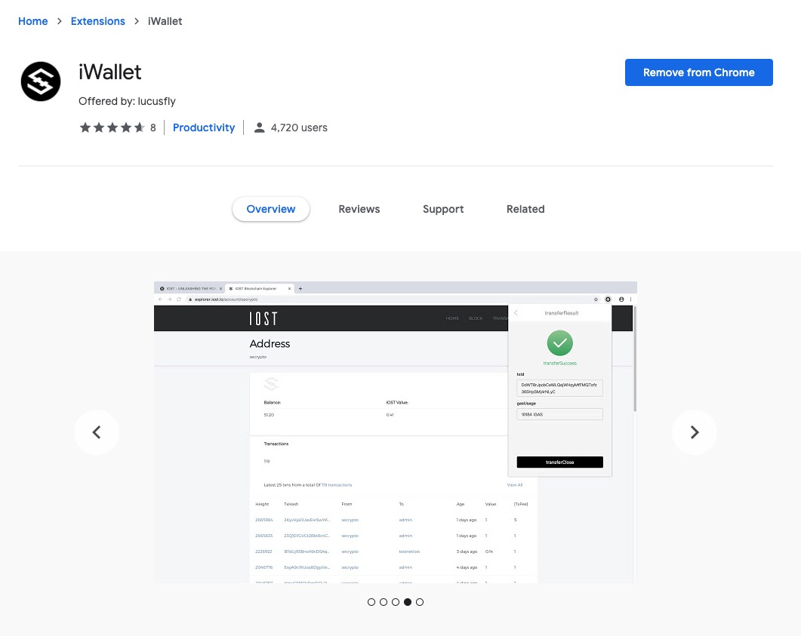
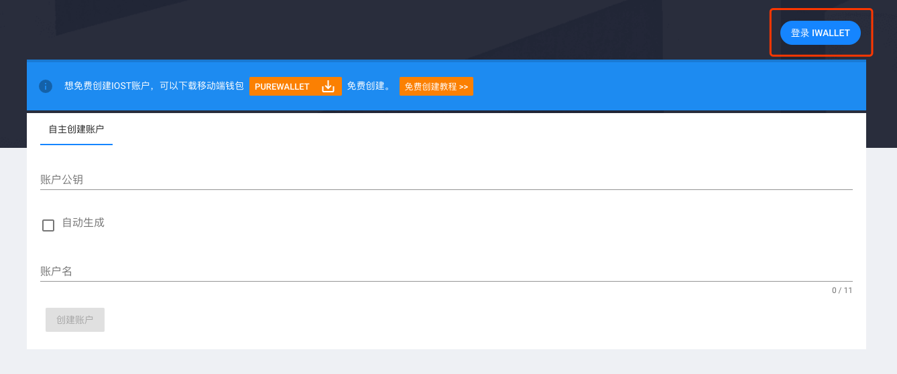
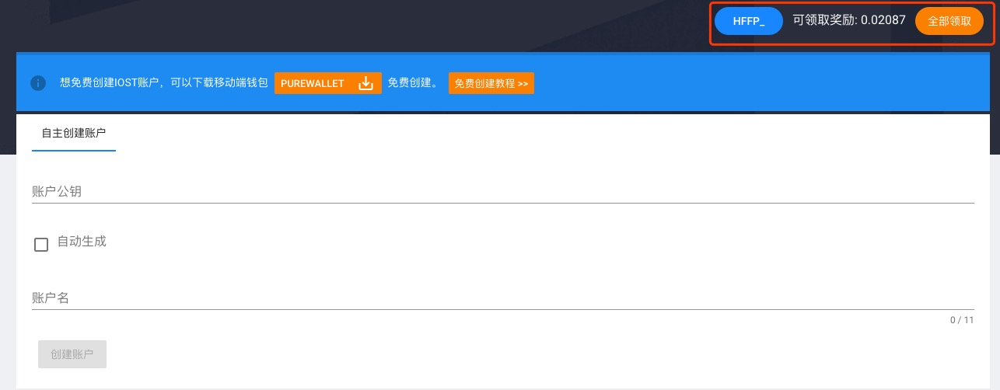
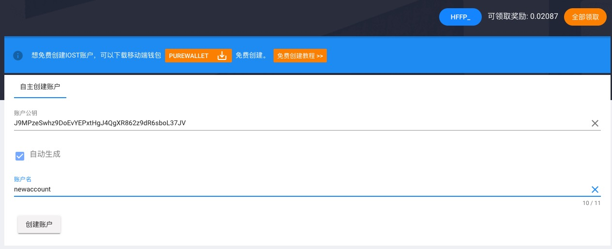

# IOST抵押创建新账户指引

## Web端

### 1. 下载并安装[iWallet](https://chrome.google.com/webstore/detail/iwallet/kncchdigobghenbbaddojjnnaogfppfj)

### 2. 打开iostabc.com的创建账户页面

[https://www.iostabc.com/wallet/createaccount](https://www.iostabc.com/wallet/createaccount)

### 3. 这个时候会提示你登陆 iWallet, 当你还没有导入 IOST账户 到你的 iWallet 的时候或者你的账户处于锁定状态的时候

### 4. 你需要在iWallet里导入一个至少有10个IOST的账户，并且保证iWallet处于解锁状态，这个时候刷新页面，会出现如下界面

### 5. 这时你就可以创建新账户了

## 移动端免费创建账户

下载 [PureWallet](https://www.purewallet.org/)，并参考教程 [https://help.purewallet.org/zh/iostaccount/](https://help.purewallet.org/zh/iostaccount/)