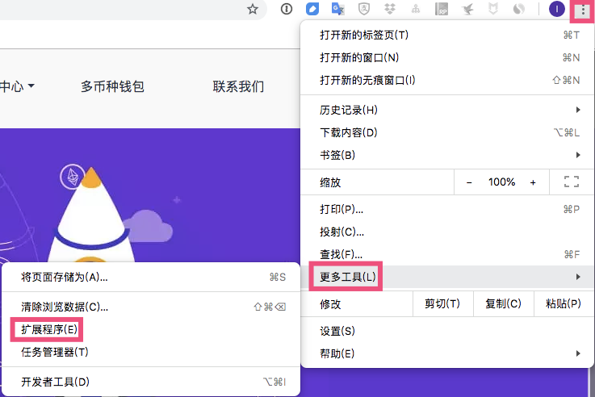
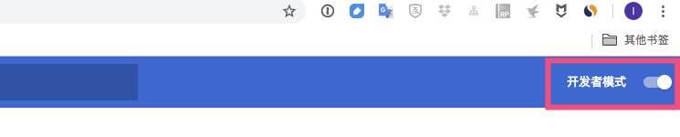
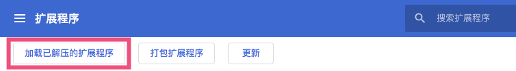
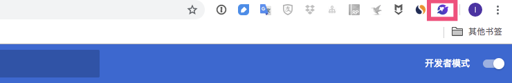

# 常见问题

## BitApp Chrome插件和Metamask有什么区别？
答：MetaMask目前只支持ETH，BitApp现已支持ETH、BCH，未来还将支持更多币种，并且提供统一的SDK调用接口，让你的应用快速支持不同公链。

## 使用BitApp SDK开发的DApp能否兼容其它钱包？
答：BitApp SDK兼容主流钱包，一次开发即可支持多条公链以及主流钱包。

## 我为什么要使用BitApp SDK开发DApp?
答：使用BitApp SDK开发应用，可以实现：

- 一次开发兼容多条公链。轻松将不同公链的持币用户变成DApp用户。
- 一次开发兼容主流钱包。使用BitApp SDK开发的DApp将无障碍上架到主流钱包的DApp商店，无需针对每一个钱包做烦琐的适配工作。
- SDK集成对资产余额、价格、交易记录、区块等信息的查询，你无需再额外寻找第三方服务。

## 我不做DApp，只是想接入数字货币支付，可以使用BitApp SDK吗？
答：完全可以。基于BitApp SDK，你无需关注区块链底层技术，只需简单的开发，即可支持多个币种的数字货币支付，享受行业红利。

## 如何领取ETH测试币？如何领取BCH测试币？
答：安装BitApp Chrome插件后，打开测试币领取网站，即可领取ETH与BCH测试币。

## 无法打开Chrome Store安装BitApp?
如果你无法科学上网，可以通过下载安装的方式进行安装，步骤如下：
1.首先确保你使用的是**Chrome浏览器**;
2.下载压缩安装包;
3.将安装包解压，并拖到一个你能找到的文件夹中，并确保其不会被删除;
4.在Chrome浏览器中，找到**设置-->更多工具-->扩展程序**;

5.打开页面右上角的**开发者模式**;

6.点击**加载已解压的扩展程序**，找到第3步中的文件夹，点击确定;

7.完成后就可以看到小火箭图标了，安装成功。


## 如果检测用户是否安装了BitApp

1. 如果用户安装了BitApp，开发者可以直接访问 window.bitapp对象

```js

if(!window.bitapp){ 
  console.error('bitapp chrome plugin is not installed')
};

```

2. 如果用户创建了BitApp账户，则可以通过如下方法来获取用户的地址

```js

bitapp.preference.getDefaultAddress().then(addresses => {
  if(!addresses.eth || !addresses.bch) {
    console.log('BitApp account not created')
  }
})

```
