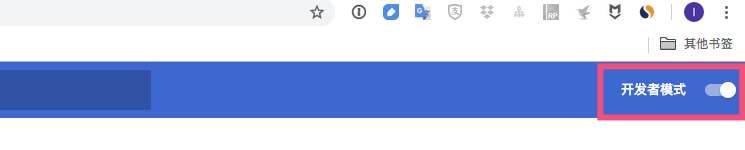
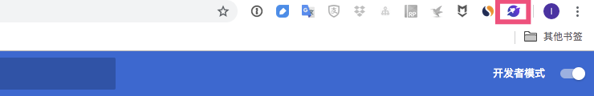

## 无法打开Chrome Store安装BitApp?

如果你无法科学上网，可以通过下载安装的方式进行安装，步骤如下：

1.首先确保你使用的是**Chrome浏览器**;

2.[下载压缩安装包](占位符);

3.将安装包解压，并拖到一个你能找到的文件夹中，并确保其不会被删除;

4.在Chrome浏览器中，找到**设置-->更多工具-->扩展程序**;

5.打开页面右上角的**开发者模式**;

6.点击**加载已解压的扩展程序**，找到第3步中的文件夹，点击确定;

7.完成后就可以看到小火箭图标了，安装成功。

